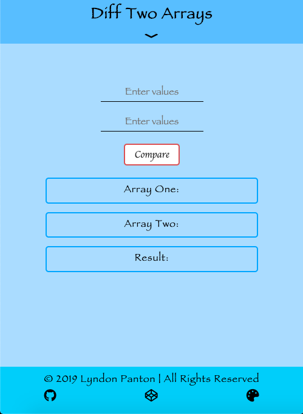
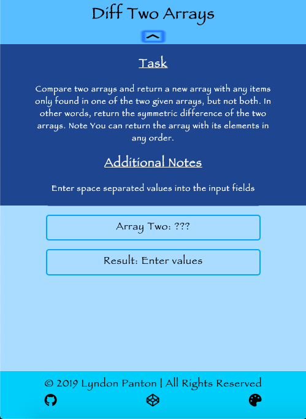
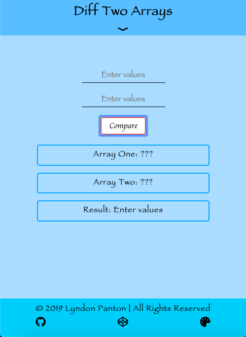
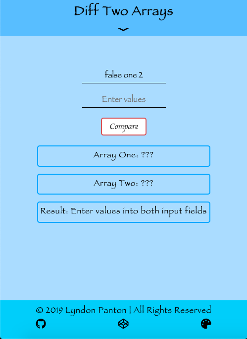
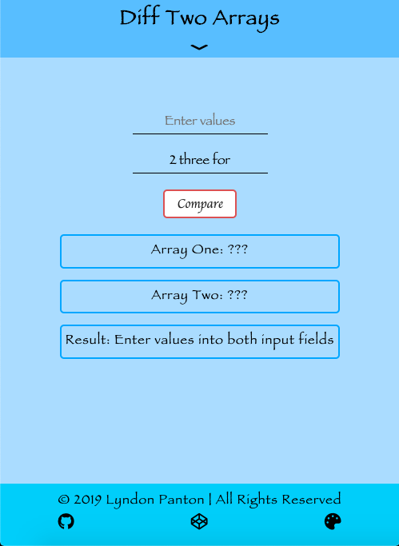
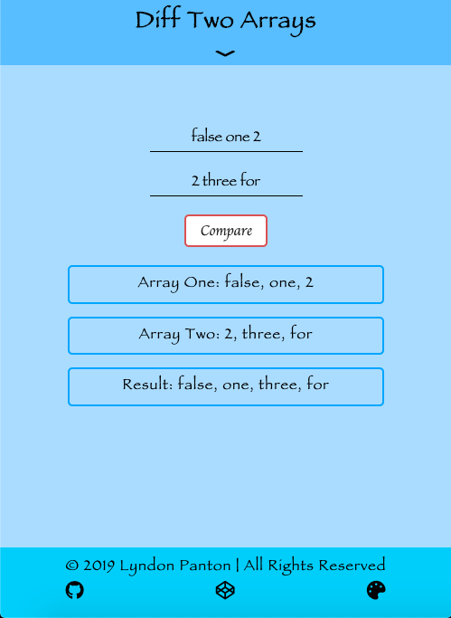
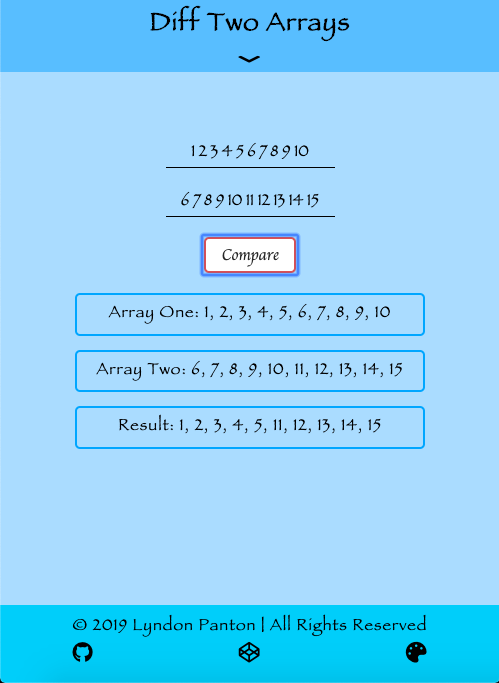

# Diff Two Arrays

## How To Open
> 1. Go to the application's download folder
> 2. Right click on the file named _index.html_
> 3. Choose the _open with_ option
> 4. Open the application in your desired browser

## How To Use
> 1. Enter space separated values into the first input field
> 2. Enter space separated values into the second input field
> 3. Press the compare button
> 4. The values in the first, second array and exclusive values in each array will be displyed

## Requirements
> 1. This application requires a browser to run
> 2. The browser must have JavaScript available and enabled

## Errors
> 1. N/A

## Extra Information
> 1. This was done for one of the activites in _freecodecamp_'s _Intermediate Algorithm Scripting_ section

## Preview

